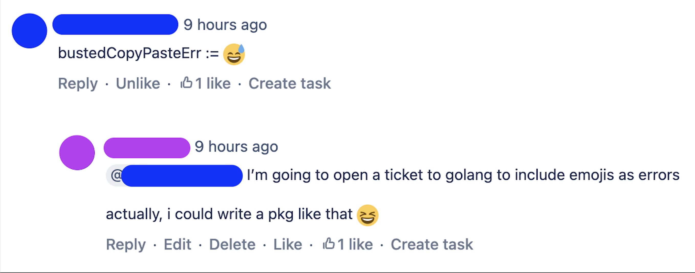

# emojerrors
Emoji errors. Helps you communicate passive aggressively.

There are a couple of golang libraries with consts for emojis out there (such as [enescakir/emoji](https://pkg.go.dev/github.com/enescakir/emoji#pkg-variables)). 
Feel free to use them or copy the unicode value yourself :heart:

##### Inspo

